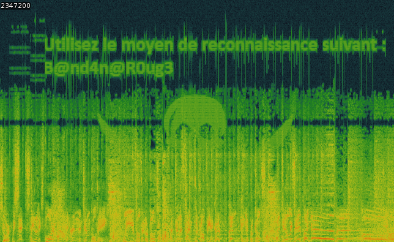
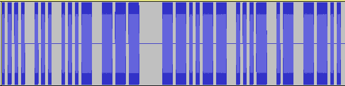
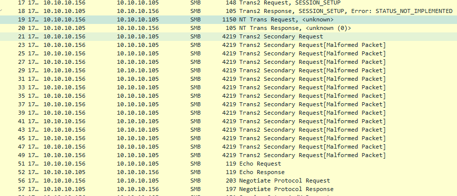
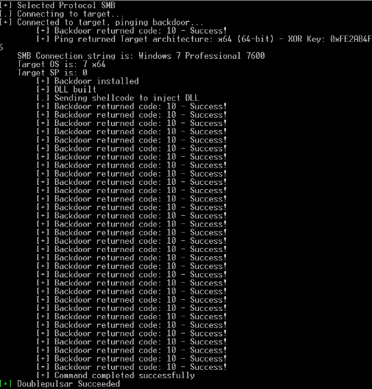
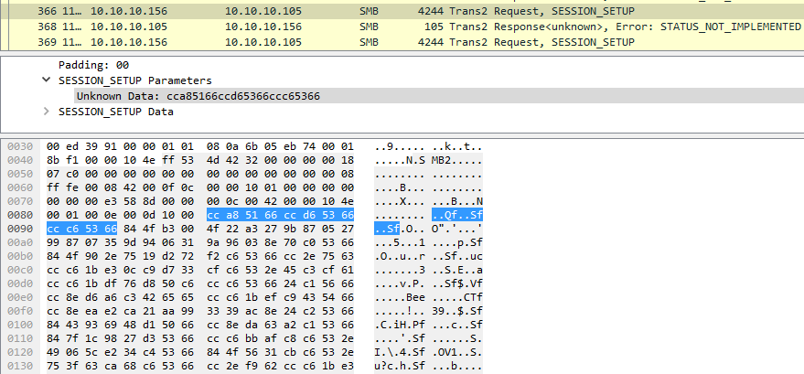
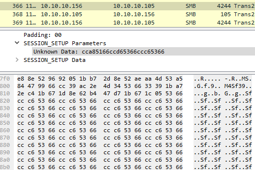
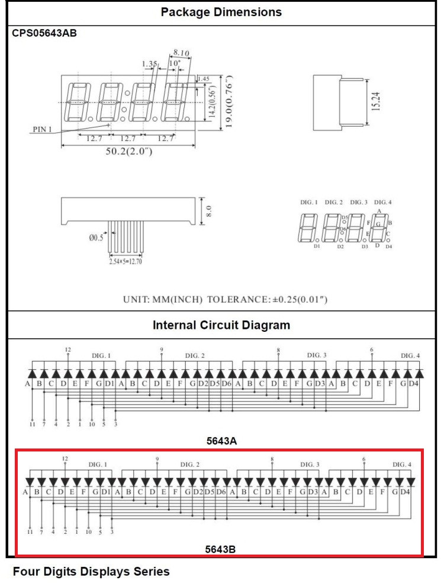
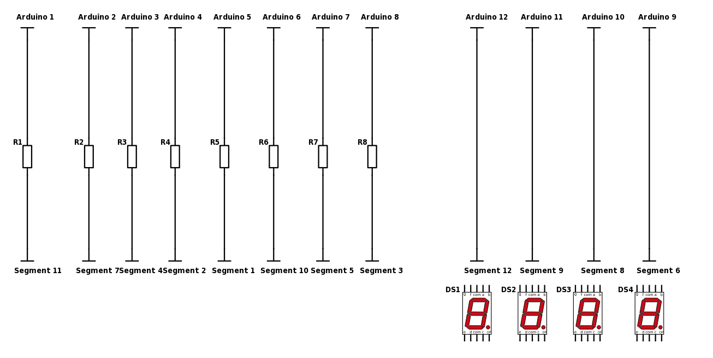

# Solutions du challenge S. Kiddy

## Challenge "0"

L’utilisation du QR-Code mène à la page d’accueil du challenge à l’adresse https://skiddy.i-tracing.com/

Cette page contient un texte chiffré, dans notre example : 

    Yja mnlanc md Axh,
    
    Un ljyrcjrwn mncnwcnda mn lnccn Unccan mn Vjazdn nbc jdcxarbn j javna nc nzdryna bxw wjeran, un YCauBpcdlkFovghHyvhTtTuRuQFcxFkt, nc ansxrwman uj ouxccn md Ljyrcjrwn B. Btrmmh jorw mn mnonwman unb rwcnancb mn uj Lxdaxwwn.
    
    Zd'ru dcrurbn un majynjd bdrejwc yxda êcan anlxwwd mnb wjeranb mn uj Lxdaxwwn :
    qccyb://btrmmh.r-cajlrwp.lxv/YCauBpcdlkFovghHyvhTtTuRuQFcxFkt
    
    Cxdc kdcrw yarb m'dw wjeran nwwnvr mn uj Lxdaxwwn yndc ncan yancnwmd yja un mncnwcnda mn lnccn unccan.
    
Il s'agit d'un ROT-17 identifiable par l'adresse https transformée en qccyb.

En faisant le décalage inverse on obtient : 

    Par decret du Roy,
    
    Le capitaine detenteur de cette Lettre de Marque est autorise a armer et equiper son navire, le PTrlSgtucbWfmxyYpmyKkKlIlHWtoWbk, et rejoindre la flotte du Capitaine S. Skiddy afin de defendre les interets de la Couronne.
    
    Qu’il utilise le drapeau suivant pour être reconnu des navires de la Couronne :
    https://skiddy.i-tracing.com/PTrlSgtucbWfmxyYpmyKkKlIlHWtoWbk
    
    Tout butin pris d\’un navire ennemi de la Couronne peut etre pretendu par le detenteur de cette lettre. 
    
Il suffit alors d'aller à l'URL spécifiée.

## Challenge 1

Le capitaine nous annonce qu'il a trouvé les débris d'une barque : 

     /|___ ///| )) /////| ))) ///////| ))) /////////| ))) ///////////| )))) /////////////| ))) //////////////| ))) ////////////////|___))) ______________|________ \ / ~~~~~~~~~~~~~~~~~~~~~~~~~~~ 

Ce texte ne ressemble à rien. Par ailleurs une clé PGP est fournie, elle pourra nous servir par la suite.

En revanche en affichant le code source de la page c'est un tout autre motif qui s'affiche : 

                       /|___<!-- R4kh@mLeR0ug3 -->
                 ///|   ))
               /////|   )))
             ///////|    )))
           /////////|     )))
         ///////////|     ))))
       /////////////|     )))
      //////////////|    )))
    ////////////////|___)))
      ______________|________
      \                    /
    ~~~~~~~~~~~~~~~~~~~~~~~~~~~
    
Il suffit de récupérer le "drapeau" pour valider l'épreuve.

## Challenge 2

Encore un message incompréhensible. Un chiffrement est à l'oeuvre. Mais si on ouvre le code source, on s'aperçoit qu'un code JavaScript est à l'oeuvre dans *mystery_box.js* : 

var alphabet = "abcdefghijklmnopqrstuvwxyz"

    function decrypt() {
        var key = document.getElementById("key").value;
    
        if (calcMD5(key) === "234af54dd004832107f19c7d1718b9c4") {
    
            var message = document.getElementById("ciphertext").value
    
            message = message.toLowerCase();
    
            var len = key.length;
            var mlen = message.length;
    
            var ki = 0;
            var ci;
            var pos;
            var result = '';
        
            for (var i = 0; i < mlen; i++) {
                pos = message[i];
                if ((/^[a-zA-Z]+$/).test(pos)) {
                    ci = alphabet.indexOf(pos.toLowerCase()) - alphabet.indexOf(key[ki]);
                    ci = ci < 0 ? 26 + ci : ci;
                    ci %= 26;
    
                    result = result + alphabet[ci];
    
                    ki = ki % len ? 0 : ki + 1;
                } else {
                    result += pos;
                }
            }
            document.getElementById("ciphertext").value = result
        }
    }

En lisant bien ce code on s'aperçoit qu'une sorte de Vigenère est à l'oeuvre. On pourrait essayer de dérouler les attaques connues dessus mais on s'aperçoit vite que le md5 de la clé est comparé à une chaîne de caractères.

En recherchant cette chaîne de caractères dans un moteur de recherche on s'aperçoit qu'elle correspond au mot "caraibes".

En utilisant cette clé pour déchiffrer le texte on obtient : 

    alors mon petit tu veux marcher sur mes platebandes ?
    
    viens te mesurer a moi a l'ile de la providencia. je t'attends.
    
    rakham

La direction particulière est providencia.

## Challenge 3

Trois clés sont sur l'image. On nous indique que le coffre auquel elles correspondent appartient à trois propriétaires.

On peut donc supposer que c'est la combinaison des 3 clés qui permet d'ouvrir le coffre.

En regardant de près les numéros de série des clés on obtient le flag UL058CS206VI080.

## Challenge 4

Un message nous indique que nous pouvons nous reposer, avec un lien.

Une fois qu'on s'est fait rickroller on peut regarder de plus près le message et on s'aperçoit que deux choses ne vont pas : le message est signé S. Kiddy et non pas capitaine S. Kiddy et le message de validation est corrompu.

Comme on nous l'a demandé plus tôt dans le challenge, on vérifie la signature PGP du message : 

    gpg: en-tête d'armure incorrect : Un peu de repos moussaillon. Tu l'as bien mérité !\n
    gpg: caractère 2D incorrect en radix64, ignoré
    gpg: caractère 2D incorrect en radix64, ignoré
    gpg: caractère 2D incorrect en radix64, ignoré
    gpg: caractère 2D incorrect en radix64, ignoré
    gpg: caractère 2D incorrect en radix64, ignoré
    gpg: caractère 2D incorrect en radix64, ignoré
    gpg: caractère 2D incorrect en radix64, ignoré
    gpg: caractère 2D incorrect en radix64, ignoré
    gpg: caractère 2D incorrect en radix64, ignoré
    gpg: caractère 2D incorrect en radix64, ignoré
    gpg: [don't know]: invalid packet (ctb=1f)
    gpg: aucune signature trouvée
    gpg: aucune donnée OpenPGP valable n'a été trouvée.
    gpg: impossible de vérifier la signature.

Le bloc PGP est invalide et la signature ne semble pas en être une !

Comme pour beaucoup de binaires qu'on veut retranscrire en caractères imprimables, PGP utilise du base 64 pour encoder les signatures, clés et certificats.

En décodant en base 64 on obtient : 

    00000000  1f 8b 08 08 18 3c 49 59  00 03 6d 65 73 73 61 67  |.....<IY..messag|
    00000010  65 2e 74 78 74 00 15 cd  31 6e 02 31 10 46 e1 de  |e.txt...1n.1.F..|
    00000020  a7 f8 a9 68 50 24 04 15  1d 45 14 45 34 2b 0a fa  |...hP$...E.E4+..|
    00000030  11 9e cd 0e 99 b5 17 8f  67 d1 72 23 ce 91 8b c5  |........g.r#....|
    00000040  b4 5f f1 de 67 45 76 c1  8d 51 d7 24 60 c7 0a df  |._..gEv..Q.$`...|
    00000050  8a 9e bc a2 66 bf 65 2f  86 f9 ef 55 a4 17 2e f0  |....f.e/...U....|
    00000060  c4 30 f9 49 54 bd 30 ae  43 a3 31 bb 19 89 6a 4e  |.0.IT.0.C.1...jN|
    00000070  58 85 70 54 e5 e7 e6 1d  34 17 c3 dd 59 ef be f6  |X.pT....4...Y...|
    00000080  84 d8 64 19 27 aa 83 34  44 a4 64 50 46 9f 53 fc  |..d.'..4D.dPF.S.|
    00000090  c0 25 cb 55 da 30 61 22  33 4c 6d 0b a5 77 a2 f2  |.%.U.0a"3Lm..w..|
    000000a0  06 33 a1 70 2d d9 e7 f6  3b 49 8c 0b 0e 38 ea 63  |.3.p-...;I...8.c|
    000000b0  bf d8 65 57 b6 fd d2 7d  75 21 9c e9 77 a0 31 fc  |..eW...}u!..w.1.|
    000000c0  03 06 67 dd b2 d2 00 00  00                       |..g......|

En-dehors de message.txt, ce binaire ne fait pas vraiment sens.

Mais n'oublions pas que base64 peut servir à encoder des fichiers (par exemple les pièces jointes binaires d'un e-mail).

Un fichier est généralement constitué de *magic bytes* situés dans les premiers octets. Si on cherche le type de fichier correspondant à 1f 8b on retrouve le format GZIP.

Une autre solution est de laisser un programme s'en charger pour nous, file : 

    Second@SkiddyShip:~/deck/$ file message.unknown 
    message.unknown: gzip compressed data, was "message.txt", last modified: Tue Jun 20 17:15:36 2017, from Unix

La commande file nous donne bien un fichier GZIP. Et en le décompressant on retrouve :
 
    Et oui je t'ai eu ! Il faut toujours vérifier une signature cher moussaillon !
    
    Allez, je suis quelqu'un de sympathique dans le fond. Voici ton pass pour la suite, va retrouver Kiddy : Alw4ysV3r1fyPGP
    
    Rakham

Le flag est donc Alw4ysV3r1fyPGP

## Challenge 5

Le challenge 5 est constitué d'une suite de nombres ainsi que d'un texte, le code des pirates de Bartholomew Roberts.

Le chiffre utilisé est le Code du Livre. C'est un chiffre simple : chaque lettre du message est codée par une position d'un mot dans un livre associé dont la première lettre est identique.

Un "mot" dans le langage cryptographique de l'époque suit les règles suivantes :
 * La ponctuation compte pour un espace,
 * Les apostrophes séparent deux mots,
 * Les mots composés sont autant de mots que le nombre des mots qui les constituent.

Suivant ces règles, il faut prendre en compte comme mots, les chiffres des articles du code des pirates.

En prenant le mot correspondant à chaque numéro on obtient (espaces et retours à la ligne restaurés) : 

    AMENER LES BARILS DE POUDRE A MON VAISSEAU AMIRAL 
    SE HATER TANT QU ON N EST PAS VUS 
    QUICONQUE OUBLIE LA PHRASE DE PASSE SERA ABATTU 
    MOT DE PASSE RAKHAMRESTELEMEILLEUR
    RAKHAM
    
Le drapeau est donc RAKHAMRESTELEMEILLEUR.

## Challenge 6

Le challenge 6 est constitué d'un fichier .doc agrémenté d'une macro VBA obfusquée. L'identification de celle-ci n'est pas extrêmement complexe.

On récupère le code brut suivant : 

    Function pixj(str As String) As Variant: Dim bytes() As Byte: bytes = str: pixj = bytes: End Function
    Function chia(bytes() As Byte) As String: Dim str As String: str = bytes: chia = str: End Function
    
    Function n95r07e9(str As String) As String
        Const p_ As String = "axqv9lb4"
        Dim sb_() As Byte, pb_() As Byte
        sb_ = pixj(str)
        pb_ = pixj(p_)
        
        Dim uL As Long
        uL = UBound(sb_)
        
        ReDim scb_(0 To uL) As Byte
        
        Dim idx As Long
        
        For idx = LBound(sb_) To uL:
            If Not sb_(idx) = 0 Then
                c = sb_(idx)
                For i = 0 To UBound(pb_):
                    c = c Xor pb_(i)
                Next i
                scb_(idx) = c
            End If
        
        Next idx
        
        n95r07e9 = chia(scb_)
    End Function
    
    
    Dim kqjtcwab As Long
    Dim rrm1ov91 As Range
    Dim tWords
    Dim m19wb31o As Boolean
    
    Sub Document_Open()
        InitializeTimer
    End Sub
    
    Sub dlgp82c0()
        tWords = Array(n95r07e9(chr(116) & "" & "i" & "" & "o" & "|" & chr(126) & "" & chr(116) & chr(115) & "" & "z" ), n95r07e9(chr(84) & chr(48) & chr(73) & "" & "O" & "\" & "" & chr(94) & "" & "T" & "S" & "Z" & "" ), n95r07e9(chr(84) & chr(48) & "i" & chr(111) & "" & chr(124) & "~" & chr(116) & "s" & chr(122) & "" ), n95r07e9("T" & "" & "I" & "O" & "\" & "" & "^" & chr(84) & chr(83) & "" & "Z" & "" ))
        kqjtcwab = ActiveDocument.Words.Count
        Set rrm1ov91 = Selection.Range
        rrm1ov91.Start = ActiveDocument.Range.Start
        m19wb31o = False
        StartTimer
    End Sub
    
    Public Sub t9pbd9k9()
        Application.OnTime When:=Now + TimeValue(n95r07e9(chr(45) & chr(45) & "" & chr(39) & chr(45) & "-" & "" & chr(39) & chr(45) & chr(44) )), _
        Name:=n95r07e9("I" & "" & "x" & "" & "n" & "" & "i" & "J" & chr(114) & "" & "o" & chr(121) & "" & "n" & "" )
    End Sub
    
    Public Sub ku6hxlp6()
        Dim p9z97scx As String
        Dim i As Long
        Dim k As Long
        Dim kw As Long
        Dim xc As Long
    
        If m19wb31o Then Exit Sub
        With ActiveDocument
            xc = .Range.Words.Count - kqjtcwab
            If xc > 0 Then
                rrm1ov91.End = Selection.End
                kw = rrm1ov91.Words.Count - 1
                If kw > 0 Then
                    For k = kw - xc + 1 To kw
                        p9z97scx = UCase(Trim(rrm1ov91.Words(k).Text))
                        For i = 0 To UBound(tWords)
                            If p9z97scx = tWords(i) Then
                                mysub (p9z97scx)
                                Exit For
                            End If
                        Next i
                    Next k
                End If
            End If
            kqjtcwab = .Range.Words.Count
        End With
        StartTimer
    End Sub
    
    Public Sub riil71st()
      'cannot stop the timer so set inactive switch
      m19wb31o = True
    End Sub
    
    Sub mysub(s As String)
      ' this subroutine is executed when a special word is entered
      MsgBox n95r07e9(chr(37) & "" & chr(89) & "" & chr(76) & "X" & "" & "$" & "" & chr(89) & "/" & "" & "[" & "" & chr(92) & "" & chr(47) & "_" & "" & "Y" & "" & "$" & "" & "%" & "" & chr(92) )
    End Sub

Quelques commentaires donnent des indices sur le fait qu'un mot spécial doit être entré pour déclencher quelque chose. On peut soit retrouver ce mot et exécuter la macro soit l'inspecter en profondeur.

La fonction n95r07e9 ressemble beaucoup à une boucle de déchiffrement XOR et est bizarrement appelée dans mysub qui affiche une MsgBox. Essayons de reconstituer la chaîne de caractères qui y est passée.

Le chiffré donne :
    
    %YLX$Y/[\/_Y$%\

En observant la fonction n95r07e9 on peut déterminer qu'il y a vraisemblablement une clé p_.

Tout d'abord la clé et la chaîne de caractères passées en paramètre sont converties du String à un tableau de Byte.

Ensuite des précautions sont prises pour déterminer le nombre de tours de boucle nécessaires suivies par le lancement effectif de la boucle.

Pour chaque élément non nul de la chaîne on boucle sur les caractères de la clé et on fait des XOR successifs avec tous les caractères de la clé.

Par exemple pour le premier caractère :
 * Le code ascii de % est 37 en décimal
 * Le code ascii de a est 97 en décimal
 * 37 xor 97 = 122
 * 122 xor 120 (x) = 2
 * etc...
 
En python cela donne : 

    cle = "axqv9lb4"
    string = "%YLX$Y/[\\/_Y$%\\"
    decode = ""
    for i in string:
      c = i
      for j in cle:
        c = c ^ ord(j)
      decode += chr(c)
    print(decode)

En déchiffrant ainsi on obtient : 8DQE9D2FA2BD98A

Il s'agit bien de notre flag et ca ne ressemble pas à un identifiant fiscal :)

## Challenge 7

En récupérant le perroquet on a une musique avec un bruit étrange qui s'immisce vers 0:56 d'écoute.

En apparence c'est un bruit blanc avec rien de particulier mais on distingue bien une arrivée progressive et un départ brutal.

Une technique de stéganographie audio pourrait être à l'oeuvre. Avec un peu de recherche et de nez on peut afficher le graphe fréquentiel dérivé de la transformation de Fourier (ou spectre) du signal.

Un outil comme Audacity ou Sonic Visualiser est capable de le faire. En affichant le spectre sur la bonne période on obtient ceci : 

Ce graphe dessine un point pour chaque fréquence rencontrée à chaque instant (en ordonnée les fréquences et en abscisse le temps).

En réalité quelque chose a été "dessiné" en incluant des ondes sinusoïdales dans les hautes fréquences et la perturbation engendrée qui est audible provient du dessin de tête de mort présent dans les fréquences les plus basses.

Et ceci nous donne le flag B@nd4n@R0ug3.

## Challenge 8

Encore un signal audio. Mais celui-ci peut rapidement être déterminé comme du morse. En effet, en l'ouvrant dans Audacity on obtient immédiatement un graphe d'amplitude caractéristique : 

Il est possible de le décoder à la main mais franchement ça vous ferait voir des "dih-dih-dih" et "dah-dah-dah" pour le reste de la journée.

Vous avez plusieurs solutions : 
 * Décoder à l'aide d'un script qui analyse l'amplitude à un échantillonnage donné (le son est très régulier),
 * Décoder à l'aide d'une transformée de Fourier (la fréquence du son est unique et forme donc un spectre simple),
 * Utiliser un outil qui implémente déjà l'une des solutions précédentes.
 
En appliquant l'une des solutions précédentes on obtient le code morse : 

    .... ... ...- --- /--..-- ...- .- --.. .-.. ..- -.-- .-.. / .-.. - / .... -.-- -. .-.. ... .... / -.-- .-.. .. .... --.. / .-.. -... -..- / ...- -.- ...- .- / .... .- --.. .-.. / ..- .-.. .--. .. / .... -.-- .... .-- / .-.-.- -.- .-.. .- --.. -... / ...- - ...- .--- ..--.. / .... .- --.. .-.. / -... --.. / --..-- .... --.. ...- .-- --.. .-.. / .-.. ..- ..- .... / ..--.. ..-. ..- ..- ...- .. / .-.. -... -..- / ..- ...- -.-- .-.. -... -- / --.. .-.. .--- .... .-- .... .--- / .-.. -.- / -.-- .... -.-- .- ..- ...- .--- ..- .-.. / .... ... / ..- ...- .--. .--- .--. --.. ...- .-- / .-.. -.- / .... ... / .... --. ..- .... -. ..- .-.. -.-. / .-.. -.- / .... ... / .... ..- .--. .-.. -.-- / ..--.. .-.. ..- ..- .... / --.. ...- - .... .- --.. .-.. / .... / .... ... / .... -.-- .-.. .-- --.. .-.. / .-.. -.- / .... ..- -... / .-.-.- .... .- --.. .-.. -... .-- --.. .-.. -.-- / --..-- .-.. .- ..- .-.. - .... .- ..- .-.. .- .... / .-.. .-.-.- -.--
    
Qui se traduit en : 

    hsvO ,vazluyL lT hynlsh ylihz lbx vkva hazl ulpi hyhw .klazb vtvJ? hazl bz ,hzvwzl luuH ?fuuvI lbx uvylbm zljhwhj lk yhyauvjul hs uvpjpzvw lk hs hguhnulc lk hs huply ?luuH zvthazL h hs hylwzl lk hub .hazlbwzly ,laulthaulaH L.Y

Aïe...

L'information importante est que le texte est vraisemblablement en espagnol (puisqu'interceptée dans des communications de navires espagnols).

En effectuant une attaque fréquentielle on obtient un texte similaire à celui-ci : 
    
    aloH ,otsenrE eM argela rebas euq odot atse neib arap .detsu omoC? atse us ,asopse ennA ?ynnoB euq noreuf secapac ed rartnocne al noicisop ed al aznagnev ed al anier ?ennA somatsE a al arepse ed anu .atseupser ,etnematnetA E.R

Re-Aïe

Les majuscules sont en fin de mot et la ponctuation est également inversée. En réinversant donc les mots : 

    Hola Ernesto,
    
    Me alegra saber que todo esta bien para usted. ?Como esta su esposa, Anne Bonny?
    que fueron capaces de encontrar la posicion de la venganza de la reina Anne? Estamos a la espera de una respuesta.
    
    Atentamente,
    R.E
    
Bingo !

On nous demande si un nom transparaît. Anne Bonny est la bonne solution.

## Challenge 9

Encore un texte chiffré !

    Drnv Hcirpnbe Xscgg, Qiapi pie yysg qmtqhfqiba, af vnic sbzi hfrnr nrj jpf lbs. Tur xsovgmr Urrsm Ricrl vw ocj ociat giofrb bl bys Fblyl Syifh! Ynqt cbwjhvbl os glf hengtbe abg ynqt frio wa Aysfny, jb n fkayy mtznab nrnv Ooffyu. Jr'pm yrrn ybh motbekeq. Fmoqrecll, W.O.

Une première chose frappe : certains caractères sont régulièrement répétés. On peut réessayer un César mais ça ne fonctionne pas, l'analyse fréquentielle n'est que peu utile.

Supposons qu'il s'agisse du chiffre de Vigenère.

Une attaque efficace sur un chiffre de Vigenère consiste à "deviner" la taille de la clé à l'aide de quadrigrammes ou trigrammes qui se répèteraient (test de Kasiski) ou en calculant l'indice de coïncidence d'une lettre sur n extraite du texte (en retenant n pour lequel l'indice de coïncidence est le plus élevé). 

Les deux sont valides mais essayons le test de Kasiski : 

| Chaîne | Fréquence d'apparition | Espacement et facteurs |
|--------|------------------------|------------------------|
| ynqt   | 2                      | 27 ( 3 9 27)           |
| rnv    | 2                      | 171 (3 9 19 57 171)    |
 
Il faut prendre les facteurs communs à l'ensemble des trigrammes et quadrigrammes découverts (ici on a un sous-ensemble mais qui sera suffisant pour le raisonnement).
 
Deux facteurs communs ressortent : 3 et 9. On peut raisonnablement penser que la taille de la clé est 9 étant donné la faiblesse d'une clé de taille 3.
 
Essayons une analyse fréquentielle en rassemblant une lettre sur 9 pour chaque alphabet : 
 
| Alphabet | Contenu                 |
|----------|-------------------------|
|Alphabet 1| dnisisntrribltottsanuyel|
|Alphabet 2| rbagbbruulalscsbffyrjbql|
|Alphabet 3| nepqazjrrvtbybgernynrhfw|
|Alphabet 4| vximaijxrwgyiwlaiymvpmmo|
|Alphabet 5| hsptfhpssoisfjfbojtomoo |
|Alphabet 6| cgiqvffomcofhhhgwbzoytq |
|Alphabet 7| igehnrlvrjfbyveyannfrbr |
|Alphabet 8| rgyfinbgiorlnbnnafafree |
|Alphabet 9| pqyqcrsmccbyqlgqykbynkc |

En exploitant une analyse fréquencielle sur l'anglais (langue des navires dont on a intercepté la conversation), on peut remonter aux décalages suivants :

| Lettre | Décalage |
|--------|----------|
| 1      |  0 - A   |
| 2      | 24 - Y   |
| 3      | 12 - N   |
| 4      | 21 - V   |
| 5      |  1 - B   |
| 6      | 19 - O   |
| 7      | 12 - N   |
| 8      | 12 - N   |
| 9      | 24 - Y   |

On comprend mieux les doublets qu'on voit régulièrement. Ils sont dûs à des lettres répétées dans un mot qui ont le même chiffré à la suite en raison de doublets également présents dans la clé.

En y regardant de plus près, on observe des fluctuations statistiques qui introduisent des erreurs dans la clé (l'échantillon statistique est faible). Mais on a débroussaillé le terrain.

De manière assez évidente on peut maintenant déduire que la clé est ANNEBONNY.

    Dear Governor Trott, 
    Since our last discussion, we have some great new for you. The traitor Henry Every is now being chased by our Royal Fleet! 
    Last position of the traitor was last seen in Nassau, in a small island near Nassau. 
    We'll keep you informed. 
    Sincerely, 
    J.K.
    
Après quelques recherches l'île la plus grande qui est proche de Nassau est la Paradise Island.

Nous avons notre flag.

## Challenge 10

Le capitaine nous donne un premier indice. La clé a été vue il y a peu.

Prenons la clé la plus récente : paradise island.

Il nous reste à comprendre quelle méthode de chiffrement est utilisée et nous pourrons tester des variantes de notre clé pour tenter de déchiffrer le message.

La présence de code hexadécimal réduit déjà les possibilités aux algorithmes de l'ère informatique. On parle bien d'une clé et non pas de plusieurs, il devrait donc être symétrique.

Partons sur AES, algorithme le plus utilisé et essayons avec plusieurs variantes de clés et différents modes de bloc.

On retrouve à force d'avancer à tâtillons (tout en se souvenant que la clé est sensible à la casse) le message.

L'algorithme AES ECB (le mode de bloc le plus simple, qui ne nécessite par ailleurs pas d'IV) a servit à chiffrer le message avec la clé PARADISE :

    Amiral,
    
    Nous avons des nouvelles pour les dernières attaques de François l'Olonnais. Il aurait été accompagné d'Hornigold. Ces derniers auraient, après un bain de sang, mis la main sur le trésor de l'El Dorado !!
    Ce trésor est la clé !
    
    Wink wink !
    
Note : AES-128 ayant été utilisé et la clé ne faisant que 64 bits, il est important d'ajouter le bon padding à chaque essai. En héxadécimal la clé est donc : 50415241444953450000000000000000

Ici le trésor est la clé, nous cherchons l'Eldorado !

## Challenge 11

Un [fichier .cap](ImagesSol/sillage.cap "Fichier .cap") nous est donné et peut être ouvert dans Wireshark.

L'analyse n'est pas aisée car 2 outils ont été lancés en même temps. Néanmoins, en sus du flux HTTPS, un certain flux est très suspect. Il s'agit du flux SMB.

Le flux SMB commence par une requête Trans2 SESSION_SETUP. La victime répond STATUS_NOT_IMPLEMENTED. Il est nécessaire à ce point d'avoir suivi l'actualité récente et de comprendre ce qui est exploité ici.

Dans un premier temps (autour du paquet 17) une exploitation de le vulnérabilité ETERNALBLUE est effectuée.

En regardant de plus près la suite des informations transmises, on peut décemment penser qu'un fichier est en cours de transfert vers la machine 10.10.10.105, victime. 

Elle correspond au transfert et à l'exécution d'un premier fichier qui est l'implant DOUBLEPULSAR.

L'attaque continue avec le paquet 364 qui prévient DOUBLEPULSAR de l'arrivée d'instructions. S'ensuivent une série de paquets transmettant vraisemblablement une grosse quantité de données qui sont illisibles.

Il reste à savoir comment ces informations sont envoyées à la machine victime.

Lors de l'utilisation de DOUBLEPULSAR, FUZZBUNCH (le client Metasploit "maison" de la NSA) affiche une information intéressante : 

En effet, une clé XOR de 4 octets est affichée lors du lancement de la commande au sein de FUZZBUNCH.

Un article très intéressant détaillant l'injection de DLL à l'aide de DOUBLEPULSAR donne des pistes sur la méthode d'envoi de la DLL injectée : https://www.countercept.com/our-thinking/analyzing-the-doublepulsar-kernel-dll-injection-technique/

En regardant d'un peu plus près notre flux SMB on peut s'intéresser plus en détail à sa structure : 

Ce qu'on voit sur cette capture est un en-tête SESSION_SETUP comportant des paramètres invalides aux yeux de Wireshark, et pour cause il s'agit d'un paramètre englobant la clé XOR que nous cherchons.

Une bonne lecture des articles de Reverse Engineering de DOUBLEPULSAR nous donne cette information.

Il s'agit en réalité des 4 derniers octets de ce paramètre : cc c6 53 66

Ceci est d'ailleurs confirmé plus loin dans certains paquets par la présence répétée de cette chaîne d'octets. En effet, certaines parties de la DLL sont remplies de 0, et 0 xor x = x.

Toutes les données qui suivent sont chiffrées par cette clé. Il suffit alors de les récupérer et les déchiffrer. À ce stade un chiffrement XOR ne devrait plus avoir de secret pour vous :o)

[Fichier chiffré récupéré](ImagesSol/encrypted_data.bin "Fichier Chiffré récupéré")

[Fichier déchiffré récupéré](ImagesSol/decrypted_data.bin "Fichier Déchiffré récupéré")

On récupère un fichier DLL, un nom de fonction aura honteusement été remplacé par le flag. De ce fait un simple strings permet d'obtenir le flag : 

    ...
    PowerShellRunner.dll
    BufferCell
    fill
    get_Item
    System
    Open
    origin
    get_Version
    NotifyEndApplication
    NotifyBeginApplication
    DRAPEAU:D0ubl3P3t1tH0mm3Vert
    destination
    System.Globalization
    System.Reflection
    CommandCollection
    get_CursorPosition
    set_CursorPosition
    _cursorPosition
    ...
    
Notre flag est donc D0ubl3P3t1tH0mm3Vert

## Challenge 12

Et voici enfin le dernier challenge !

Beaucoup plus facile que le précédent, il est constitué d'un code source Arduino et d'un schéma de câblage électronique.

    #include <math.h>
    
    char segments[8] = {1,2,3,4,5,6,7,8};
    int controlPins[4] = {9,10,11,12};
    char previousPressed = 0;
    int counter = 789;
    int delayer = 1;
    
    int numberDisplays[10][8] = {
    {1,1,0,1,1,0,1,0},
    {1,1,1,0,0,0,0,0},
    {1,1,1,1,1,1,1,0},
    {1,1,1,1,0,1,1,0},
    {1,1,1,1,0,0,1,0},
    {0,1,1,0,0,1,1,0},
    {1,0,1,1,0,1,1,0},
    {1,0,1,1,1,1,1,0},
    {0,1,1,0,0,0,0,0},
    {1,1,1,1,1,1,0,0},
    };
    
    void setup() {
      for(int i = 0; i < 8; i++)
        pinMode(segments[i], OUTPUT);
      for(int i = 0; i < 4; i++)
        pinMode(controlPins[i], OUTPUT);
    }
    
    void loop() {
      for(int j = 0; j < 4; j++) {
        for(int k = 0; k < 4; k++) {
          digitalWrite(controlPins[k], LOW);
        }
        for(int k = 0; k < 8; k++) {
          digitalWrite(segments[k], HIGH);
        }
        digitalWrite(controlPins[j], HIGH);
        for (int i = 0; i < 7; i++) {
            digitalWrite(segments[i], !numberDisplays[j*2%8][i]);
        }
        delay(delayer);
      }
    }

Le but est de déterminer ce qui est affiché sur les afficheurs 7-segments et donc d'obtenir le code du cadenas. C'est au choix : on a un Arduino et on refait le câblage ou on réfléchit.

Les pins 1 à 12 qui sont configurés en pins de sortie. Les pins 1 à 8 sont dédiés au contrôle des segments et les pins de 9 à 12 au contrôle du multiplexage (seul un afficheur à la fois peut être allumé si on veut des chiffres différents).

En lisant la datasheet on en déduit : 

| Pin | Segment |
|-----|---------|
| 1   | A       |
| 2   | B       |
| 3   | C       |
| 4   | D       |
| 5   | E       |
| 6   | F       |
| 7   | G       |
| 8   | D1      |

| Pin | Afficheur |
|-----|-----------|
| 9   | 1         |
| 10  | 2         |
| 11  | 3         |
| 12  | 4         |

En lisant le code on s'aperçoit de plusieurs choses : 
 * Les segments à allumer pour un chiffre sont regroupés dans un tableau,
 * Les chiffres ne sont pas dans l'ordre du tableau,
 * Une boucle affiche les éléments du tableau 0, 2, 4 et 6.

Attention, c'est bien quand le pin qui contrôle le segment est à 0 que le segment est allumé.

Ainsi en reconstituant de fil en aiguille on obtient le code : 5382